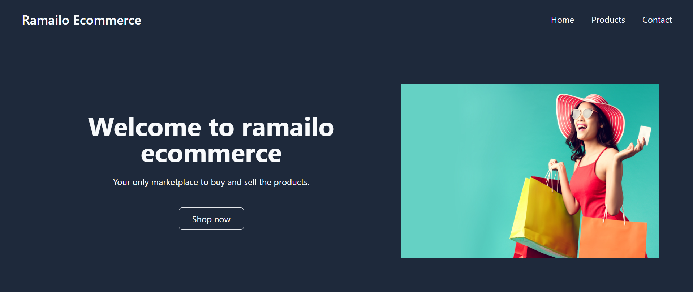

# For Frontend
```
$ git clone https://github.com/dhamaladev/ecommerce-frontend.git
$ cd ecommerce-frontend
$ npm install
$ npm run dev
```

Now you are good to go as frontend will start on port http://localhost:5173/

